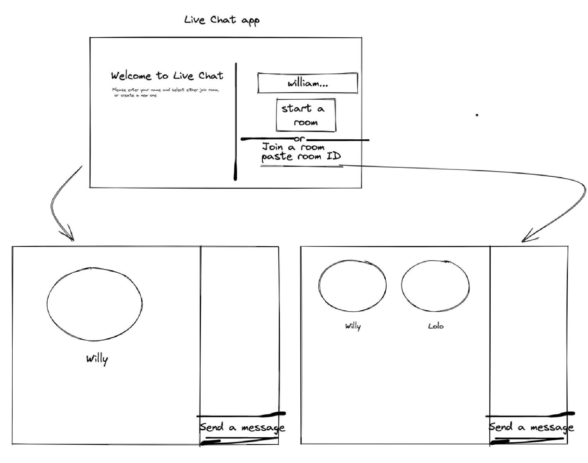

# Live-Chat Application

In this project, I implemented a real-live chat application, where you can create a room, or enter an existing one by adding the room ID.

On entering the room, you can have a video chat along with a place where you can text the room participants.

## How can we use the application



First, we see the home screen, where you can either:

- Create a new room, but you have to add your name first.
- Join an existing room, where you have to enter your name and the room ID where you can join your friends.

On joining/creating a room, on the very right side of the screen you can see a chat panel, where you can check all the texts from your friends even the old texts!

On leaving the room, you just exit the webpage, and automatically your friends will no longer see you in the room.

Don't worry, on we remember your name on joining again. If you used our application before and you added your name, we remember the name on opening the home screen. :)

## TECH Stack

---

- [NodeJs](https://nodejs.org/en/) for backend server.
- [Socket.io](https://socket.io/) for creating a web socket to enable chat/video calls between users.
- [WebRTC](https://webrtc.org/) for having Real-time communication for the web.
- [ReactJS](https://reactjs.org/) for our frontend application.
- [Tailwind](https://tailwindcss.com/) for styling.

## Run Locally

Clone the project

```bash
  git clone https://github.com/YoussefWilliam/live-chat-app
```

> First we run the server

Go to the server directory

```bash
  cd server
```

Install dependencies

```bash
  yarn install
```

Start the server

```bash
  yarn start
```

---

> Then we run the client

Go to the client directory

```bash
  cd client
```

Install dependencies

```bash
  yarn install
```

Start the client

```bash
  yarn start
```

## Run by docker

If you have docker installed, run

```bash
  docker-compose up
```
